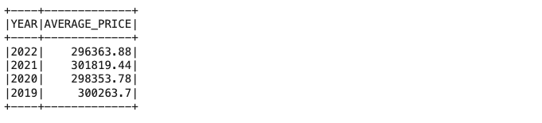
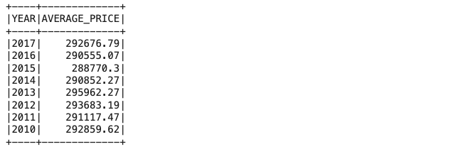
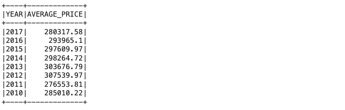
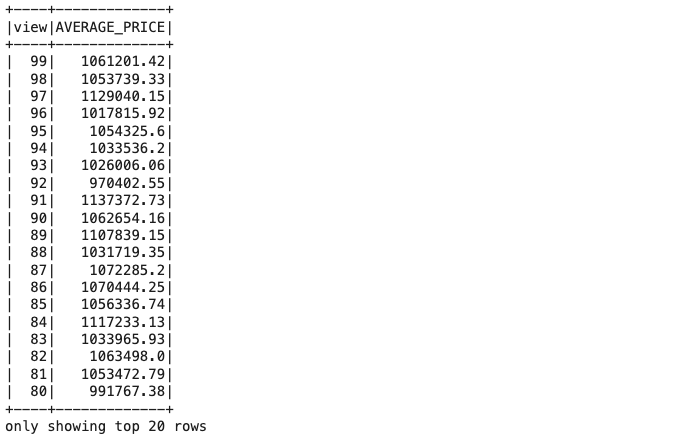
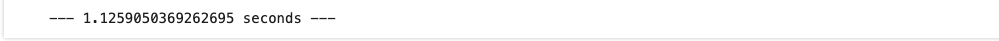
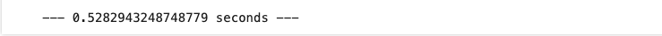
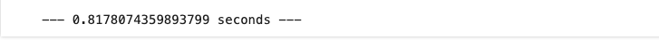

# Home_Sales Challenge

### Background

For this challenge, we have been tasked to use our knowledge of SparkSQL to determine key metrics about home sales data. Then we used Spark to create temporary views, partition the data, cache and uncache a temporary table, and verify that the table has been uncached.

### Questions

The following questions were answered:

1. What is the average price for a four-bedroom house sold for each year?

   
1. What is the average price of a home for each year the home was built, that has three bedrooms and three bathrooms?

   
1. What is the average price of a home for each year the home was built, that has three bedrooms, three bathrooms, two floors, and is greater than or equal to 2,000 square feet?

   
1. What is the average price of a home per "view" rating having an average home price greater than or equal to $350,000?

   

### Run Times

Question 4 uncached run time: 

Question 4 cached run time:

Question 4 partioned run time:

### Requirements

1. A Spark DataFrame is created from the dataset.
2. A temporary table of the original DataFrame is created.
3. A query is written that returns the average price, rounded to two decimal places, for a four-bedroom house that was sold in each year.
4. A query is written that returns the average price, rounded to two decimal places, of a home that has three bedrooms and three bathrooms for each year the home was built.
5. A query is written that returns the average price of a home with three bedrooms, three bathrooms, two floors, and is greater than or equal to 2,000 square feet for each year the home was built rounded to two decimal places.
6. A query is written that returns the average price of a home per "view" rating having an average home price greater than or equal to $350,000, rounded to two decimal places. (The output shows the run time for this query.)
7. A cache of the temporary "home_sales" table is created and validated.
8. The query from step 6 is run on the cached temporary table, and the run time is computed.
9. A partition of the home sales dataset by the "date_built" field is created, and the formatted parquet data is read.
10. A temporary table of the parquet data is created.
11. The query from step 6 is run on the parquet temporary table, and the run time is computed
12. The "home_sales" temporary table is uncached and verified.

---
